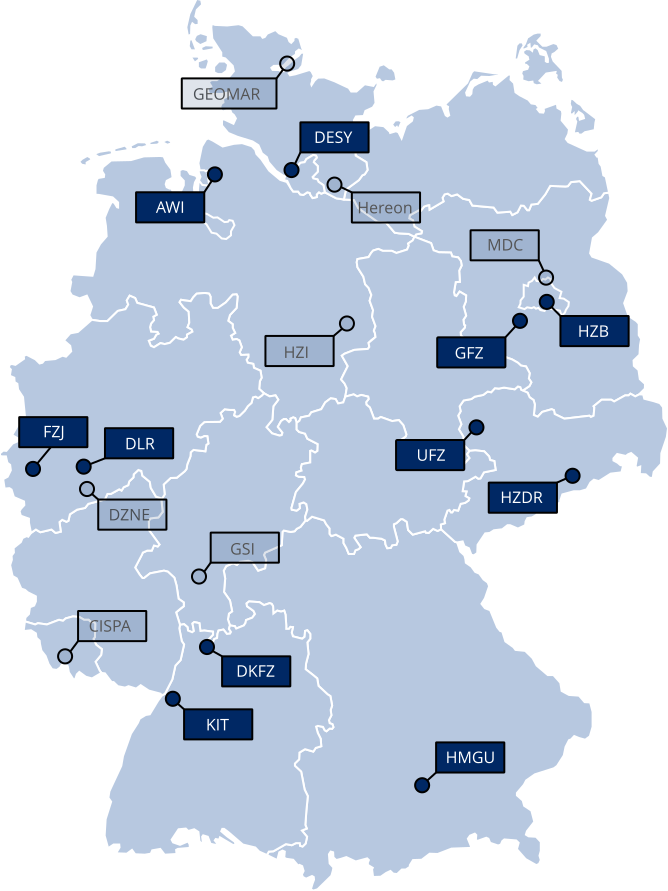
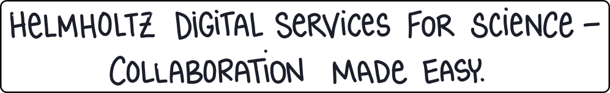
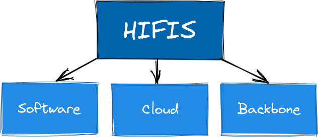
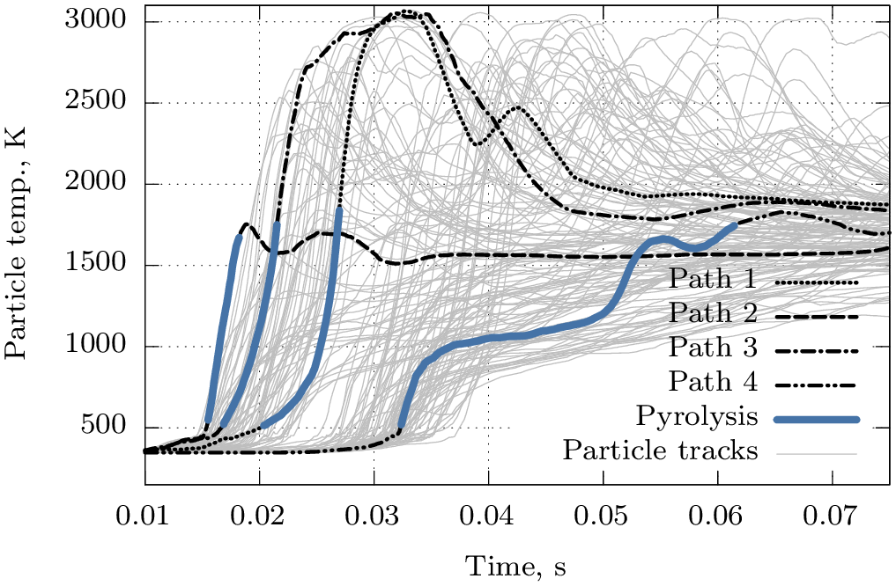

# HIFIS (2021-2024)
at the Helmholtz Center Dresden Rossendorf (HZDR)

<header>
<link href="//vjs.zencdn.net/7.10.2/video-js.min.css" rel="stylesheet">

</header>

\newcommand{\si}[1]{\mathrm{#1}}
\newcommand{\SI}[2]{#1\,\mathrm{#2}}
\newcommand{\*}{\ }

::: notes
Derzeit bin als IT consultant 

Example:
I'm currently a social media manager for a tech start-up. I execute the content strategy for various social media channels.
:::

<!----------------->
<!----- Slide ----->
<!----------------->
## What is HIFIS

<!----- 
{style="transform:scale(0.85);" fig-align="left"}
{style="transform:scale(0.85);" fig-align="left"}
## {background-image="./images/hifis-homepage.png" background-link="https://hifis.net"}
## {width=15%}
----->

<!------ NOTES ------>
::: notes

- Thank you for the kind introduction. 
- Also welcome to my presentation.
- My name is Thomas Förster and work at the Helmholtz center HZDR in Dresden
- I am going to talk about a Consulting experience HIFIS initiative. 

<!------->

First of all I would like to introduce to you the HIFIS platform. 

- HIFIS is a colaboration platform  of 11 out of 18+1 Helmholtz centers
- The goal of HIFIS is to builds and sustains an excellent IT infrastructure across the Helmholtz association
- We want to embrace the sustainability idea data, software and services

<!------->

- The initiative is build on three pillars: Software/Cloud/Backbone
- Cloud/Backbone are responsible for supporting infrastrucure
- And Software, where I originate from, is working on the clients side and we also operate important user heavy services like gitlab and mattermost

<!------->

:::
<!------------------->

:::::: columns

<!---- column ---->
::: {.column width=45%}

{style="width:90%;"}

:::
::: {.column style="width:55%;"}

{width="65%"}
{width="60%"}

- I was part of HIFIS (Software) at HZDR
- HIFIS share IT services & resources **within Helmholtz**
- Goals are to ensures sustainability of data, software and services 
- I providing and supported **consultations** and **trainings**

:::
::::::

<!----------------->
<!----- Slide ----->
<!----------------->
## My Task at HZDR/HIFIS

:::::: columns
::: column

**My Role a Consultant [(Link)](https://www.hifis.net/services/software/consulting/)**

- Lead of the group
- [Standarization of Workflows (Handbook)](https://www.hifis.net/consulting-handbook/)
- [Organization and Documentation](https://codebase.helmholtz.cloud/hifis/software/consulting)
- [Code project documentation (mkdocs)](https://github.com/tfoerst3r/generate_mkdocs)
- Software Quality Assurance (SQA)
- PR and RSE community building ([GitLab](https://codebase.helmholtz.cloud/rse-community) and [Indico](https://events.hifis.net/category/123/))

:::
::: column

**My Supported Consulting Project (gitlab & github)** 

- [Cod Growth Model (Code + Structure + CI)](https://codebase.helmholtz.cloud/awi_paleodyn/growth-model-atlantic-cod)
- [TetraX (CI)](https://www.tetrax.software/index.html) 
- [IQTools](https://github.com/xaratustrah/iqtools)
- *Shotsheet* a documentation tool based on flask + mongo (inhouse, docker compose)

**Other Projects**

- [Reporting Tools](https://github.com/tfoerst3r/reptool)
- [Course material for python, indico, mkdocs](https://www.hifis.net/services/software/training/) 

:::
::::::

<!--==========-->
<!--== Past ==-->
<!--==========-->
# Research Assistant (2013-2019)

as a Researcher at the TU Freiberg

<!----------------->
<!----- Slide ----->
<!----------------->
## Reactor Simulation

:::::: columns
::: {.column width=30%}

<video 
  id="my-player" 
  class="video-js" 
  controls 
  data-setup='{}' 
  autoplay 
  height=700>
  <source src="./images/gsp018_42asym.webm" type="video/webm"/>
</video>

:::

::: {.column width="70%"}

**Gasification Simulations**

- 2D/3D CFD (computer fluid dynamics) simulations
- Non-catalytic partial oxidation
- Primary fuel coal
- High pressure $>\SI{20}{bar(a)}$
- High temperature $>\SI{1500}{K}$
- Estimation of pyrolysis/heterogeneous boundary conditions
- Boundary conditions wall modeling
:::
::::::

{.absolute top=100 right=10 width="600"}

<!----------------->
<!----- Slide ----->
<!----------------->
## Model developments

:::::: columns
::: {.column width="48%"}

**Preprocessor for $\mathrm{\bf C_{x}H_{y}O_{z}N_{a}S_{b}}$ (python)**

- Solver to determine different decomposition compositions

**Wall two-way boundary conditions (c routine for ANSYS Fluent)**

- Iterative approach to determine a 1D heat loss at the wall depending on the solid/liquid phases sticking to the walls
:::

::: {.column width="4%"}
:::

::: {.column width="48%"}
**0D Model for heterogeneous reactions (python)**

- Boundary Conditions are based on transient Data for 
    - partial gas pressures
    - temperatures
- [Particle Conversion Repo (github)](https://github.com/tfoerst3r)

**Post flame characterisation (bash, python)**

- What reactions are dominant in which area of the flame
- Flame is defined via the $\mathrm{OH^-}$ concentration

:::
::::::

<!--============-->
<!--== Future ==-->
<!--============-->
# Prospects (2025)

<!----------------->
<!----- Slide ----->
<!----------------->
## {}

:::::: columns

::: column

#### Current activities

- ML Course at geeksforgeeks.com
- Workshops (bash, quarto) at the Datenspuren (C3D2)
    
:::

::: column

#### Areas I am interest in

- Machine Learning
- Software Quality Assurance
- Software Development
- DevOps (Deploying own services, like HedgeDoc)

:::

::::::

<!----------------->
<!----- Slide ----->
<!----------------->
## {}

:::::: columns
::: {.column width="35%"}
:::
::: {.column width="30%"}

**Thank you.**     If you have any questions do not hesitate to ask. 
:::
::: {.column width="35%"}
:::
::::::

